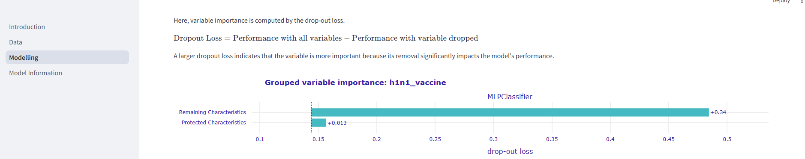
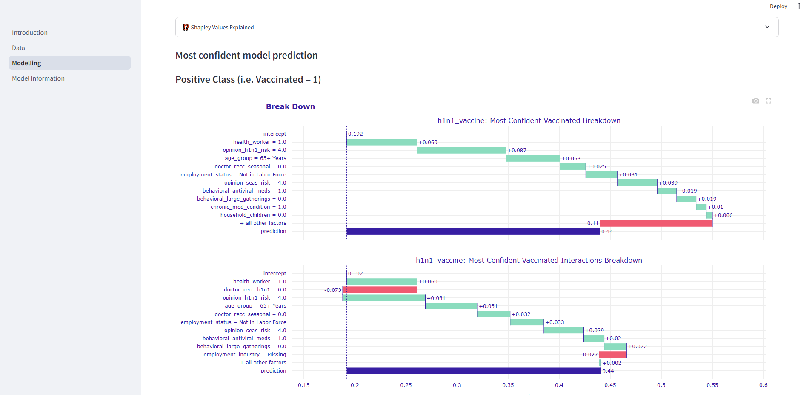
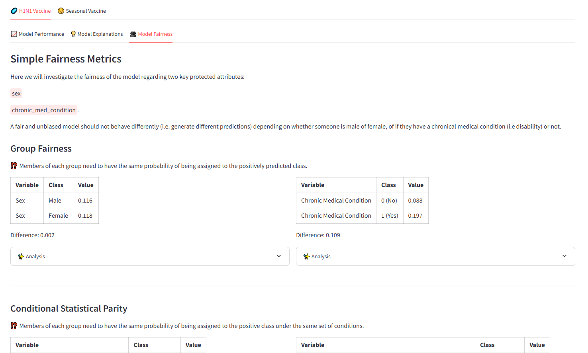
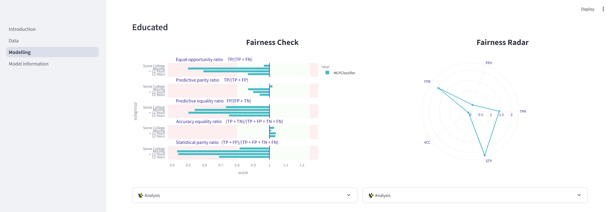

# Flu Explainer
This repository contains the group assigments of Human-Centered Data Science — Summer Term 2024 by Prof. Claudia Mueller-Birn at Free University of Berlin.

## Final App Demonstration
The gem of this repository is a streamlit-based app that allows different stakeholders (users, decision makers, subject experts, etc.) to
- Explore the data
- Monitor model performance, inspect explanations, and assess fairness
- Learn more about the analyses and algorithms used

### Impressions
#### Data Analyis


#### Model Performance


#### Model Explanation
How much does it rely on protected attributes such as sex and chronic medical coniditions?


How are generally decisions made by the model? How do different values influence the prediction?
In this example, how do individual attributes contribute to overall prediction?


#### Fairness Analysis
There are a lot of definitions of fairness. How do they compare? W.r.t. to certain fairness definitions,
is our algorithm fair?




### Install and Run
Make sure you're in the `app` subdirectory (not the zip archive) of this repository.
Create a virtual environment and install the package in it:
- **Linux or MacOS:**
    ```bash
    python3 -m venv .venv
    source .venv/bin/activate
    python3 -m pip install --upgrade pip
    python3 -m pip install -r requirements.txt
    python3 -m streamlit run 1_Introduction.py
    ```
- **Windows:**
    ```cmd
    py -m venv .venv
    .venv\Scripts\activate
    py -m pip install --upgrade pip
    py -m pip install -r requirements.txt
    py -m streamlit run 1_Introduction.py
    ```

## Team
- Henry El-Jawhari
- Ferdinand Koenig
- Johannes Englmeier
